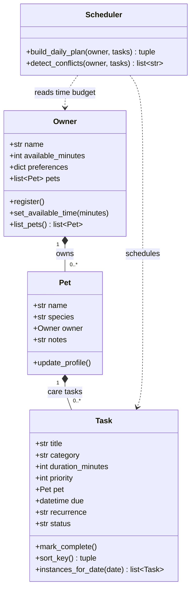

# PawPal+ — UML class diagram (Mermaid)

Preview: paste the fenced block into [Mermaid Live Editor](https://mermaid.live) or use a Mermaid preview extension in VS Code.

This diagram uses the **four core classes** from the brainstorm (**Owner**, **Pet**, **Task**, **Scheduler**). The planner’s output can stay a simple return value (ordered tasks + messages) without a separate type in code.

**Relationships in plain language**

- **Owner → Pet (one-to-many):** An owner manages zero or more pets; each pet belongs to one owner.
- **Pet → Task (one-to-many):** A pet has zero or more care tasks; each task is for one pet.
- **Scheduler → Owner, Task (dependency):** The scheduler does not own pets or tasks; it **uses** the owner’s available time and the task list to order work and flag conflicts.

**Optional:** If you want a fifth box for the return value of `build_daily_plan`, add a small **DailyPlan** class with `ordered_tasks` and `messages`—only if it clarifies your implementation.

## Review checklist

- **Owner has Pets** — matches “household with multiple animals.”
- **Pet has Tasks** — tasks are anchored to a pet.
- **Scheduler stays thin** — reads constraints and tasks; no redundant “owns everything” hub.

For **Phase 6**, revisit this file and align the diagram with `pawpal_system.py`.
